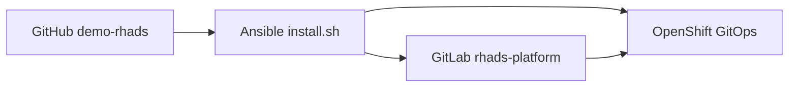
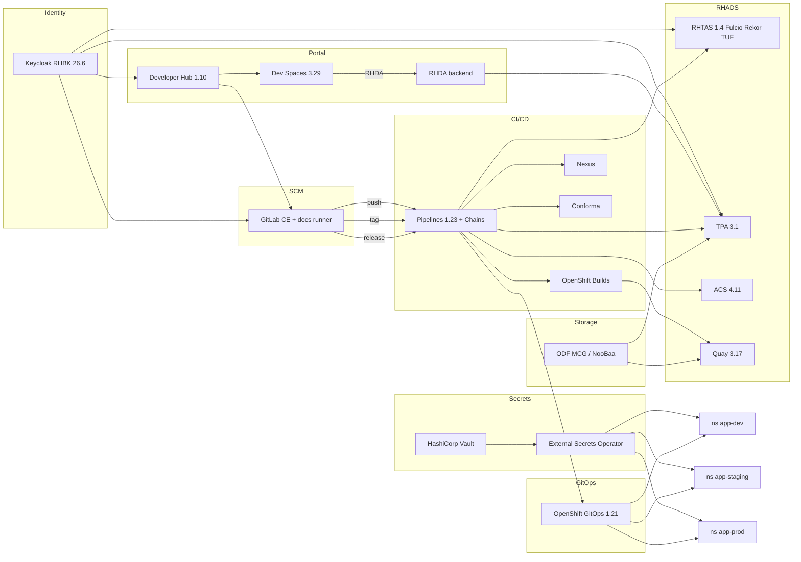

# Architecture — RHADS software supply chain demo

## Goal

A repeatable platform, installed with Ansible and reconciled by OpenShift GitOps, to demonstrate **software supply chain security** with Red Hat Advanced Developer Suite on OpenShift 4.20+.

## Source of truth

| Copy | Role |
| --- | --- |
| **GitHub** `panchoraposo/demo-rhads` (`main`) | Installer and templates for the **next** cluster. This is what you clone. |
| Local working tree | What `./install.sh` actually applies, then force-pushes to GitLab. |
| GitLab `platform-engineers/rhads-platform` | What Argo CD reconciles **after** install. Hostnames are substituted (`GITLAB_HOST_PLACEHOLDER`, `QUAY_HOST_PLACEHOLDER`, `CLUSTER_SUBDOMAIN_PLACEHOLDER`). |

A sandbox that is thrown away and recreated only sees GitHub. Live GitLab edits do not survive that cycle unless they are committed here first.

## Components

Object storage is **OpenShift Data Foundation Multicloud Object Gateway** (NooBaa). Quay uses an ObjectBucketClaim; TPA uses filesystem storage on RBD plus an optional OBC for future S3 use.

## Identity and OIDC

Realm **`backstage`**: Developer Hub, GitLab, Fulcio/gitsign (`trusted-artifact-signer`). Realm **`trustify`**: TPA and the RHDA backend.

The TAS client includes loopback URLs and `urn:ietf:wg:oauth:2.0:oob`. Keycloak 26 treats `*` as http(s) only; Dev Spaces has no `xdg-open`, so gitsign uses the OOB verification code.

Developer Hub waits for SSO at boot. If Keycloak comes up after Hub has already cached a failed `Issuer.discover`, `rhads-hub-oidc-watchdog` restarts the Hub deployment.

## Software templates

Five Developer Hub templates, all app-of-apps:

- `quarkus-agentic` — Quarkus MCP server (Red Hat build of Quarkus **3.20.6**, n-1 CVE demo)
- `quarkus-hitl` — Miles of Smiles human-in-the-loop agents (Quarkus **3.33** + LangChain4j + MaaS, JDK 21). Default name `miles-smiles`.
- `camel-supervisor` — Miles of Smiles **supervisor** agents (step 04 from [demo-camel-agentic](https://github.com/panchoraposo/demo-camel-agentic): Kaoto YAML + Camel JBang 4.18 + MaaS in Dev Spaces; cluster image is Camel Quarkus **3.33** / Camel **4.18**, JDK 21). Default name `miles-camel`.
- `camel-agentic` — Camel Quarkus REST agent (n-1 CVE demo)
- `nodejs-agentic` — Express agent

Component **name maxLength is 18** (OpenShift/Kubernetes name limits for the generated namespaces and resources). Default for the CVE path: `quarkus-agent`.

`quarkus-hitl` is current RHBQ (not n-1) so the HITL APIs work. Dev Spaces exposes **fleet-ui** and **quarkus-dev-ui** (`/q/dev-ui`) on port 8080. `POST /car-management/return/{id}` returns **202** immediately and the workflow runs on a worker (Che would abort a 5-minute HITL POST). The UI polls `/api/approvals/pending`. The cluster Route still has a 300s timeout for other clients. MaaS `MAAS_API_KEY` is written to HashiCorp Vault (`secret/apps/{app}`) by the bootstrap Job and synced into each environment by External Secrets Operator. GitOps no longer carries a Kubernetes `Secret` object for that key.

`camel-supervisor` is also current RHBQ/Camel (not n-1) so `camel-quarkus-openai` and Kaoto `*.camel.yaml` routes work. Inner loop is **Camel JBang 4.18** (command palette → **Camel JBang + MaaS**), not `quarkus:dev`. Open `integrations/03-workflow.camel.yaml` with **Kaoto**. Public endpoint **camel-ui** (`/`) and **camel-devui** (`/q/dev`). Collision on Civic `#7` goes to **PENDING_DISPOSITION** (step 04 has no Keep/Dispose HITL). The cluster image is the same YAML on Camel Quarkus so Tekton Maven + `Dockerfile.jvm` stay identical to the other Java templates. Staging/prod stay at 0 replicas until a GitLab tag/release. Dev Recreate reseeds the in-memory fleet.

The scaffolder creates:

1. A source repo in the GitLab `developers` group
2. An `{app}-gitops` repo with `argocd/applications.yaml` (build + dev + staging + prod)
3. An Argo CD bootstrap Application on `argocd/`

The CVE-demo templates (`quarkus-agentic`, `camel-agentic`, `nodejs-agentic`) ship **n-1** runtimes on purpose so TPA/RHDA have findings: Quarkus/Camel **3.20.6.redhat-00004**, OpenJDK **ubi8/openjdk-17**, Node.js **ubi9/nodejs-18**, plus known-vulnerable libraries (`commons-text` 1.9, `snakeyaml` 1.33, `express` 4.18.2, `lodash` 4.17.20). Ansible seeds matching OSV advisories into TPA; full CVE importers stay disabled so they do not fill the sandbox PVC.

Catalog `catalog-info.yaml` sets `backstage.io/kubernetes-id` and **does not** set `backstage.io/kubernetes-namespace`. Hub Topology therefore lists the same deployment in `{app}-dev`, `{app}-staging`, and `{app}-prod`. Pinning the annotation to `-dev` hid the other environments.

## Secrets (Vault + External Secrets Operator)

HashiCorp Vault (file storage, UI on the `vault` Route) is the store. The **External Secrets Operator for Red Hat OpenShift** (`stable-v1`) deploys the `external-secrets` operand. `ClusterSecretStore` `vault-backend` uses Kubernetes auth.

| Path | Written by | Synced to |
| --- | --- | --- |
| `secret/rhads/ci/*` | Ansible at install (`gitlab-token`, `quay-dockerconfig`, `cosign-signing-key`, `acs-ci`, `tpa-oidc`, `rhads-pipeline-env`) | Every namespace labeled `rhads.demo/ci-secrets=true` via `ClusterExternalSecret` |
| `secret/apps/{component_id}` | Scaffolder bootstrap Job (`app-seed` role) | `{app}-maas` in dev/staging/prod via `ExternalSecret` (HITL and Camel supervisor templates) |

Argo CD `managedNamespaceMetadata` sets that label when it creates `{app}-dev`, `{app}-staging`, and `{app}-prod`. Vault UI login: `vaultadmin` / `backstage`. Root token: secret `vault/vault-init`.

## First pipeline after create

Helm installs a `{app}-build-cache` PVC (`WaitForFirstConsumer`). Argo CD waits for all resources to be Healthy **before** PostSync hooks. If copy-secrets and webhook were PostSync Jobs, they never ran while the PVC stayed Pending.

Those Jobs are **normal resources** (`Replace=true`):

1. **copy-secrets** — authenticate to Vault (Kubernetes auth, role `app-seed`) and write `secret/apps/{app}`; wait for External Secrets Operator to sync platform CI secrets (`gitlab-token`, Quay dockerconfig, cosign, ACS, TPA) from `secret/rhads/ci/*` into `{app}-dev` / staging / prod (falls back to copying from `rhads-ci` if ESO is still catching up); copy non-secret ConfigMaps; create the Quay repo.
2. **webhook** — GitLab hook (push / tag / release) on the EventListener, create Quay repo `rhads/{app}` and grant `rhads+pipeline`, then POST a fake push so the **first PipelineRun** starts without a developer push.

The scaffolder commit is **unsigned**. Task `gitsign-verify` warns and continues so the first SBOM still lands in TPA. `conforma-dev` (STRICT=false) reports `rhads_source.git_commit_signed` and does not fail. Tagging that commit for staging runs the same Conforma task with STRICT=true and **denies promotion**. The signed Dev Spaces commit is the one the live demo promotes.

GitLab Auto DevOps is disabled. A single instance runner builds TechDocs from the docs-only `.gitlab-ci.yml`. Application CI is Tekton, not GitLab CI.

## Promotion

| GitLab event | Pipeline | Environment | Conforma |
| --- | --- | --- | --- |
| `push` to `main` | `{app}-build` | `{app}-dev` | report, non-blocking |
| `tag_push` | `{app}-promote` overlay `staging` | `{app}-staging` | STRICT; unsigned git commit denied |
| `release` create | `{app}-promote` overlay `prod` | `{app}-prod` | STRICT |

Each build pipeline:

1. `git-clone` + `gitsign verify` (RHTAS TUF; unsigned scaffold commits warn only)
2. Maven / npm against **Nexus** (`maven-public` / `npm-group`). Job `rhads-maven-warm` runs `mvn package` for the Quarkus and Camel template POMs, then publishes `raw-hosted/rhads/m2-seed.tar.gz`. Task `rhads-build-source` extracts that tarball onto the app `{app}-build-cache` PVC when the local repo is empty, then `mvn -o package`.
3. **OpenShift Builds** (BuildConfig Docker strategy, binary `--from-dir`) → Quay
4. Syft CycloneDX + SPDX
5. `cosign sign` with the **demo key** and **upload to Rekor**
6. `cosign attest` SBOM + `cosign attach sbom`
7. `roxctl image scan` and `image check` (ACS)
8. Upload SBOM to Trusted Profile Analyzer
9. `ec validate image` against collections **`@redhat`** and **`@slsa3`**, plus **`rhads_source.git_commit_signed`** (gitsign / RHTAS). STRICT on staging/prod: an unsigned git tag is denied. Image signatures may use the demo key; Chains provenance is verified keyless (Fulcio identity + Rekor + TUF). Konflux-only rules (hermetic buildah, source-image, CPE labels, …) are excluded in `rhads-conforma-policy`. The promote task clones the tagged commit (PipelineRun `source-repo` + `image-tag`) and runs `gitsign verify` before `ec validate image`.
10. Commit the digest to the GitOps overlay + GitLab comment
11. Tekton Chains signs TaskRun/PipelineRun **keyless**: Fulcio issues a short-lived cert for `tekton-chains-controller` (Kubernetes OIDC), Rekor records the signature, TUF distributes the RHTAS trust root.

`chains-status` is a `finally` task. It dumps `chains.tekton.dev/*` annotations; it does **not** sign. Signing is asynchronous in `tekton-chains-controller`. Distinct from `sign-image` (cosign + demo key on the image).

## Inner loop (Dev Spaces)

Devfile env points gitsign at cluster Fulcio, Rekor, Keycloak issuer, and TUF (`https://tuf-trusted-artifact-signer.apps.<cluster>`). Command palette:

1. **Configure Sigstore git commit signing (gitsign + RHTAS TUF)** — install gitsign, `gitsign initialize --mirror … --root root.json` (private Fulcio is not in the public Sigstore TUF).
2. `git commit` — copy the printed OIDC URL, log in as `dev1` / `backstage`, paste the code. Certificate identity is the Keycloak email (`dev1@rhads.demo`).
3. **Verify Sigstore-signed HEAD (gitsign + RHTAS TUF)** — `gitsign verify` with `--certificate-identity` and `--certificate-oidc-issuer`.

RHDA in VS Code posts to the in-cluster **RHDA backend**, which queries this cluster’s TPA (not Red Hat’s SaaS analyzer).

## Resources (single-node sandbox)

Clair disabled, ACS scanner at 1 replica, TPA without tracing/metrics, GitLab all-in-one. Block storage: `gp3-csi`. Object storage: ODF MCG (NooBaa); Quay uses ObjectBucketClaims.
