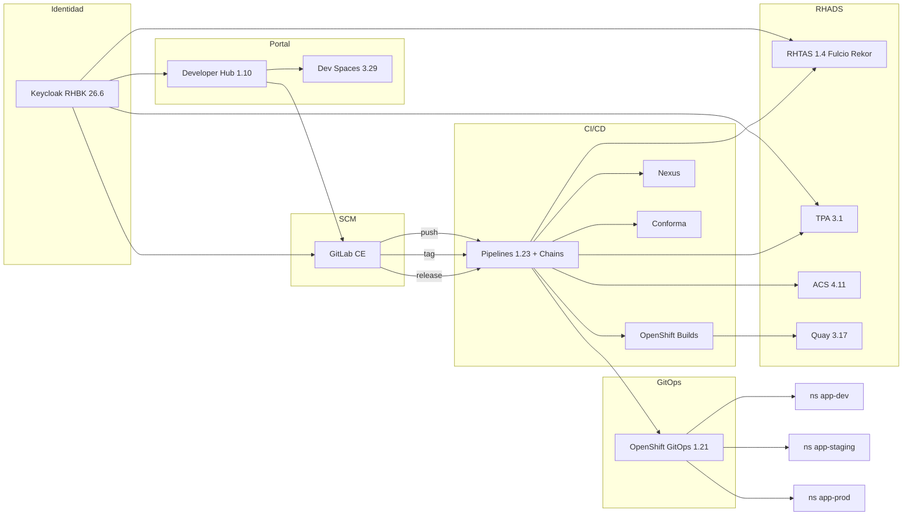

# Arquitectura — RHADS software supply chain demo

## Objetivo

Una plataforma repetible, instalada con Ansible y reconciliada con OpenShift GitOps, para demostrar **seguridad en la cadena de suministro** con Red Hat Advanced Developer Suite sobre OpenShift 4.20+.

## Componentes

## Promoción

| Evento GitLab | Pipeline | Entorno | Conforma |
| --- | --- | --- | --- |
| `push` a `main` | `{app}-build` | `{app}-dev` | informe, no bloquea |
| `tag_push` | `{app}-promote` overlay `staging` | `{app}-staging` | STRICT |
| `release` create | `{app}-promote` overlay `prod` | `{app}-prod` | STRICT |

Cada pipeline de build:

1. `git-clone` + `gitsign verify` (RHTAS; el commit de Dev Spaces usa gitsign, misma raíz que cosign)
2. Maven / npm contra **Nexus** (`maven-public` / `npm-group`)
3. **OpenShift Builds** (BuildConfig estrategia Docker, binary `--from-dir`) → Quay
4. Syft CycloneDX + SPDX
5. `cosign sign` con clave de demo y **upload a Rekor**
6. `cosign attest` SBOM + `cosign attach sbom`
7. `roxctl image scan` y `image check` (ACS)
8. Upload SBOM a Trusted Profile Analyzer
9. `ec validate image` (Conforma; STRICT en staging/prod)
10. Commit del digest al overlay GitOps + comentario en GitLab
11. Tekton Chains firma el PipelineRun (in-toto / SLSA)

## Software templates

Tres templates en Developer Hub, todos app-of-apps:

- `quarkus-agentic` — MCP server Quarkus (Red Hat build of Quarkus)
- `camel-agentic` — Camel Quarkus REST agent
- `nodejs-agentic` — Express agent

El scaffolder crea:

1. Repo de código en el grupo GitLab `developers`
2. Repo `{app}-gitops` con `argocd/applications.yaml` (build + dev + staging + prod)
3. Application Argo CD bootstrap sobre `argocd/`

## Recursos (sandbox 1 nodo)

Clair deshabilitado, scanner ACS en 1 réplica, TPA sin tracing/metrics, GitLab all-in-one. Storage de bloques: `gp3-csi`. Object storage: **OpenShift Data Foundation** Multicloud Object Gateway (NooBaa) con el operador **ODF Multicluster Orchestrator (MCO)**; Quay y TPA usan ObjectBucketClaims.
